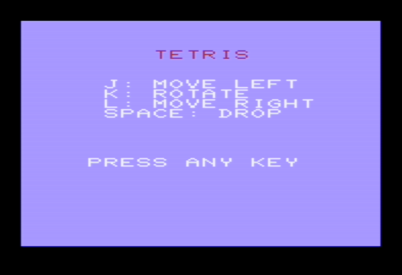
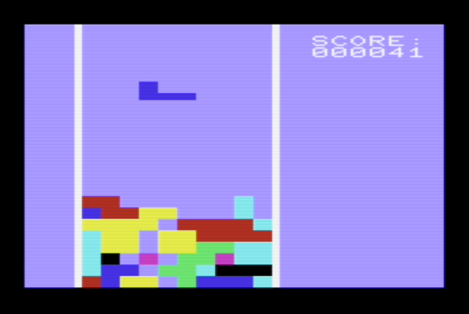
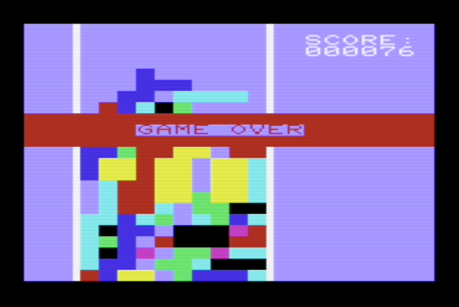

# VIC-20 Tetris

This project is a minimal Tetris game for the unexpanded
Commodore VIC-20. The executable is about 1.8k. It is 
written in assembler for [CA65](https://cc65.github.io/doc/ca65.html).

To save memory, the game pieces are encoded as single bytes and unpacked
into a four by four buffer. For example, the **T** piece is defined as
***11100100***, the first four bits define its upper half, the
lower four the bottom.

The screen representaiton of placed pieces is the only representation.
Not having a separate model of the board saves a 230 bytes, but makes
for a lot of fiddling with 16-bit pointers during collision detection.
The increased number of instructions may negate the initial space
savings. On the other hand, a separate buffer of this size would not 
fit in Zero Page memory, so you would be left fiddling with pointers
anyway.

The 6502 does not have a multiply instruction, so as a point of honour,
this program does not multiply anyhting.

Utility functions were cribbed from around the web. The integer to
string (by way of BCD) routines were lifted from [vic20-aliens-inv](https://github.com/DarwinNE/vic20-aliens-inv).

## Bugs and Limitaitons

* Runs well on VICE but not verified on real hardware.
* Levels are not implemented.
* Collision detection is a mess, has bugs, and should be redone from scratch.
* Needs better sound effects.
* Random number generation needs improvement.
* Flicker is a problem, so rendering needs to be synchronized with video output.

## Useful Links

* [6502 Instruction Set](https://www.pagetable.com/c64ref/6502/?tab=2)
* [VIC-20 Memory Map](http://www.zimmers.net/anonftp/pub/cbm/maps/Vic20.MemoryMap.txt)

